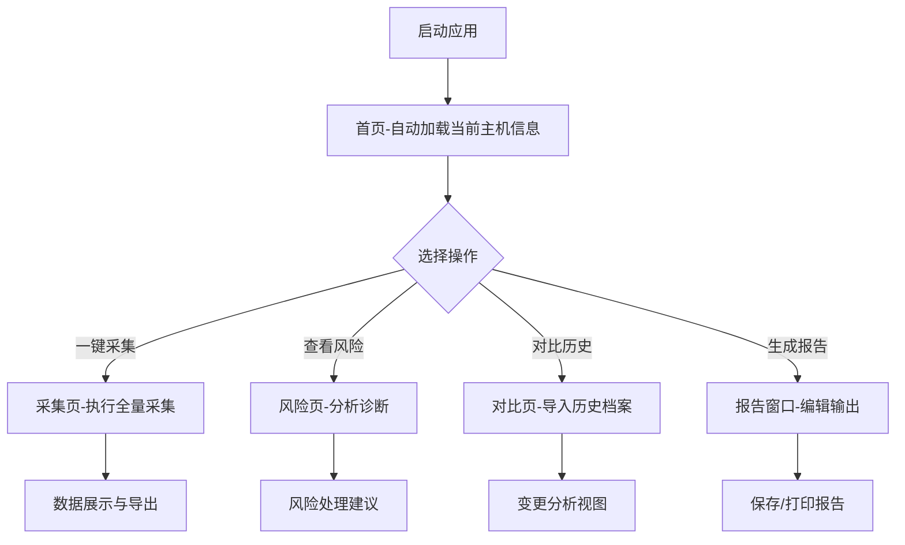

# 桌面主机画像仪 - 产品需求文档

## 1. 产品概述

桌面主机画像仪是一款面向电脑维护人员的专业系统信息采集与分析工具，旨在帮助技术人员快速、全面地了解目标电脑的运行状态、硬件配置、软件环境及潜在风险。

- **核心价值**：一键采集、风险预警、变更追踪、报告输出，提升维护效率
- **目标用户**：企业IT运维人员、电脑维修技师、系统管理员
- **使用场景**：日常巡检、故障诊断、交接验收、安全审计

## 2. 功能模块

### 2.1 页面结构

| 页面名称 | 功能定位 | 核心模块 |
|---------|---------|---------|
| 首页 | 主机概览仪表盘 | 主机名称、操作系统、硬件总览、磁盘占用、网络状态 |
| 采集页 | 深度信息采集 | 安装软件、启动项、外设、共享目录、账户列表、登录记录 |
| 风险页 | 问题诊断分析 | 磁盘空间、异常启动项、长期未更新软件、开放共享 |
| 对比页 | 历史变更追踪 | 硬件变化、软件增删、配置差异 |
| 报告窗口 | 交付文档生成 | 现场备注、维护建议、本地保存、打印交付单 |

### 2.2 首页 - 主机概览

**模块列表：**
- **主机标识卡片**：显示计算机名、操作系统全称与版本、最后启动时间
- **硬件总览面板**：CPU型号与核心数、内存总量与使用率、显卡信息
- **磁盘状态图表**：各分区容量、已用空间、可视化条形图
- **网络信息摘要**：IP地址、MAC地址、网络适配器列表、连接状态

### 2.3 采集页 - 系统信息采集

**采集项目：**
- **安装软件列表**：名称、版本、发行商、安装日期
- **启动项管理**：程序名称、路径、启动位置（注册表/启动文件夹）、启用状态
- **外设连接记录**：设备名称、类型、连接状态、驱动程序版本
- **共享目录清单**：共享名称、本地路径、访问权限、连接用户
- **账户列表**：用户名、账户类型、最后登录时间、组成员
- **最近登录记录**：登录时间、账户名、来源IP（域环境）

**交互设计：**
- 一键全量采集按钮
- 分项独立采集
- 采集进度指示
- 数据导出为JSON/CSV

### 2.4 风险页 - 问题诊断

**风险检测规则：**
| 风险类型 | 判断条件 | 严重程度 |
|---------|---------|---------|
| 磁盘空间不足 | 任一分区可用空间 < 10GB 或 < 10% | 高危 |
| 异常启动项 | 启动项路径不在白名单内或无数字签名 | 中危 |
| 长期未更新软件 | 距上次更新超过180天 | 低危 |
| 开放共享 | 存在非必要共享文件夹 | 中危 |

**展示形式：**
- 风险概览统计（高危/中危/低危数量）
- 风险明细列表（类型、描述、建议操作）
- 一键修复快捷入口

### 2.5 对比页 - 历史对比

**功能要点：**
- 导入历史画像文件（JSON格式）
- 自动识别新增/删除/变更项
- 三栏对比视图：历史值 → 当前值 → 变更状态
- 差异高亮标记（绿色-新增、红色-删除、黄色-修改）
- 对比摘要报告

### 2.6 报告窗口 - 交付文档

**报告内容：**
- 封面信息（设备名称、采集时间、维护人员）
- 系统摘要
- 风险项清单及处理建议
- 维护建议（基于风险分析自动生成）
- 现场备注（支持手动输入）
- 设备变更记录

**输出方式：**
- 保存为本地JSON档案
- 打印交付单（适配A4纸）
- 导出为PDF（浏览器打印功能）

## 3. 技术架构

### 3.1 技术选型

- **前端框架**：React 18 + TypeScript
- **构建工具**：Vite
- **样式方案**：Tailwind CSS
- **状态管理**：Zustand
- **路由管理**：React Router DOM
- **图标库**：Lucide React
- **图表库**：Recharts（磁盘可视化）
- **模拟数据**：内置完整Mock数据，支持本地JSON导入

### 3.2 页面路由

| 路径 | 页面 | 说明 |
|-----|-----|-----|
| `/` | 首页 | 主机概览仪表盘 |
| `/collect` | 采集页 | 信息采集与管理 |
| `/risks` | 风险页 | 风险诊断与分析 |
| `/compare` | 对比页 | 历史对比 |
| `/report` | 报告窗口 | 报告生成与导出 |

### 3.3 数据模型

**SystemProfile（主机画像）：**
```typescript
interface SystemProfile {
  hostname: string;
  os: { name: string; version: string; build: string };
  cpu: { model: string; cores: number; threads: number };
  memory: { total: number; used: number; slots: MemorySlot[] };
  disks: Disk[];
  network: NetworkAdapter[];
  software: Software[];
  startupItems: StartupItem[];
  peripherals: Peripheral[];
  shares: SharedFolder[];
  users: UserAccount[];
  loginRecords: LoginRecord[];
  profileTime: string;
}
```

## 4. 视觉设计

### 4.1 设计风格

- **主题**：深色科技风 + 数据仪表盘风格
- **色调**：深灰底色（#0f172a）+ 科技蓝主色（#3b82f6）+ 状态色（成功#22c55e、警告#f59e0b、危险#ef4444）
- **圆角**：中等圆角（rounded-xl）
- **阴影**：柔和发光阴影（glow效果）
- **字体**：JetBrains Mono（数据展示）、Noto Sans SC（中文正文）

### 4.2 布局结构

- **顶部导航栏**：Logo + 页面切换标签 + 快捷操作
- **左侧边栏**：功能菜单（可折叠）
- **主内容区**：卡片式布局，响应式栅格
- **底部状态栏**：采集状态、数据更新时间

### 4.3 动效设计

- 页面切换：淡入淡出 + 轻微上移
- 数据加载：骨架屏 + 脉冲动画
- 交互反馈：按钮悬停发光、卡片悬停微浮
- 进度指示：环形进度条 + 百分比数字

## 5. 用户流程



## 6. 优先级定义

### P0（核心功能）
- 首页主机信息展示
- 采集页一键采集
- 风险页风险识别
- 报告窗口本地保存

### P1（重要功能）
- 对比页历史对比
- 打印交付单
- 数据导出功能

### P2（增强功能）
- 维护建议自动生成
- 外设详细信息
- 登录记录详情
