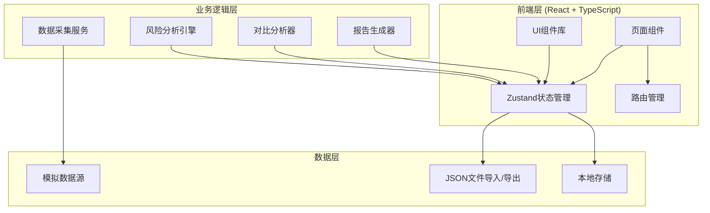

# 桌面主机画像仪 - 技术架构文档

## 1. 架构设计



## 2. 技术栈详情

| 类别 | 技术选型 | 版本 |
|-----|---------|-----|
| 框架 | React | 18.x |
| 语言 | TypeScript | 5.x |
| 构建工具 | Vite | 5.x |
| 样式方案 | Tailwind CSS | 3.x |
| 状态管理 | Zustand | 4.x |
| 路由 | React Router DOM | 6.x |
| 图表 | Recharts | 2.x |
| 图标 | Lucide React | 最新版 |
| 打包 | 原生浏览器打印 | - |

## 3. 路由定义

```typescript
const routes = [
  { path: '/', component: HomePage, name: '首页' },
  { path: '/collect', component: CollectPage, name: '采集' },
  { path: '/risks', component: RiskPage, name: '风险' },
  { path: '/compare', component: ComparePage, name: '对比' },
  { path: '/report', component: ReportPage, name: '报告' }
];
```

## 4. 状态管理结构

```typescript
interface AppStore {
  // 主机画像数据
  profile: SystemProfile | null;
  isLoading: boolean;
  lastUpdate: string | null;

  // 采集状态
  collectionStatus: CollectionStatus;
  collectionProgress: number;

  // 风险数据
  risks: RiskItem[];

  // 历史对比
  currentProfile: SystemProfile | null;
  historicalProfile: SystemProfile | null;
  comparisonResult: ComparisonResult | null;

  // 报告数据
  reportNotes: string;
  maintenanceSuggestions: string[];

  // Actions
  loadProfile: () => Promise<void>;
  collectAll: () => Promise<void>;
  analyzeRisks: () => void;
  loadHistorical: (file: File) => Promise<void>;
  generateReport: () => ReportData;
}
```

## 5. 数据模型

### 5.1 核心数据类型

```typescript
// 主机画像
interface SystemProfile {
  hostname: string;
  os: { name: string; version: string; build: string };
  cpu: { model: string; cores: number; threads: number };
  memory: { total: number; used: number; slots: MemorySlot[] };
  disks: Disk[];
  network: NetworkAdapter[];
  software: Software[];
  startupItems: StartupItem[];
  peripherals: Peripheral[];
  shares: SharedFolder[];
  users: UserAccount[];
  loginRecords: LoginRecord[];
  profileTime: string;
}

// 磁盘信息
interface Disk {
  letter: string;
  label: string;
  total: number;
  used: number;
  free: number;
  fileSystem: string;
}

// 网络适配器
interface NetworkAdapter {
  name: string;
  type: string;
  mac: string;
  ipv4: string;
  ipv6: string;
  status: 'connected' | 'disconnected';
}

// 软件信息
interface Software {
  name: string;
  version: string;
  vendor: string;
  installDate: string;
  lastUpdate: string;
  size: number;
}

// 启动项
interface StartupItem {
  name: string;
  path: string;
  location: 'registry' | 'startup-folder' | 'scheduled-task';
  enabled: boolean;
  publisher: string;
  signed: boolean;
}

// 外设
interface Peripheral {
  name: string;
  type: 'input' | 'storage' | 'network' | 'display' | 'other';
  status: 'connected' | 'disconnected';
  driver: string;
}

// 共享文件夹
interface SharedFolder {
  name: string;
  path: string;
  permissions: string[];
  connectedUsers: number;
}

// 用户账户
interface UserAccount {
  username: string;
  type: 'admin' | 'standard' | 'guest';
  lastLogin: string;
  groups: string[];
  disabled: boolean;
}

// 登录记录
interface LoginRecord {
  time: string;
  username: string;
  source: string;
  type: 'local' | 'domain';
}

// 风险项
interface RiskItem {
  id: string;
  type: 'disk-space' | 'startup' | 'outdated-software' | 'open-share';
  severity: 'high' | 'medium' | 'low';
  title: string;
  description: string;
  suggestion: string;
  relatedData: any;
}

// 对比结果
interface ComparisonResult {
  added: ComparisonItem[];
  removed: ComparisonItem[];
  changed: ChangedItem[];
  summary: {
    hardwareChanges: number;
    softwareAdded: number;
    softwareRemoved: number;
    configChanges: number;
  };
}
```

## 6. 目录结构

```
src/
├── components/           # 通用组件
│   ├── ui/             # UI基础组件
│   ├── cards/          # 卡片组件
│   ├── charts/         # 图表组件
│   └── layout/         # 布局组件
├── pages/              # 页面组件
│   ├── Home/           # 首页
│   ├── Collect/        # 采集页
│   ├── Risk/           # 风险页
│   ├── Compare/         # 对比页
│   └── Report/         # 报告窗口
├── stores/             # Zustand状态
├── services/           # 业务逻辑
│   ├── collector.ts    # 采集服务
│   ├── analyzer.ts     # 分析服务
│   ├── comparator.ts   # 对比服务
│   └── report.ts       # 报告服务
├── types/              # TypeScript类型
├── data/               # Mock数据
├── utils/              # 工具函数
└── App.tsx             # 应用入口
```

## 7. 关键实现说明

### 7.1 数据采集
- 使用setTimeout模拟异步采集过程
- 采集进度通过事件回调更新
- 支持分项采集和全量采集

### 7.2 风险分析
- 基于预定义规则进行风险检测
- 磁盘空间：< 10GB 或 < 10% 为高危
- 启动项：无数字签名且不在白名单为中危
- 软件更新：距今 > 180天 为低危

### 7.3 历史对比
- 支持导入JSON格式的历史画像
- 自动计算新增、删除、变更项
- 提供详细的差异清单

### 7.4 报告生成
- 收集所有分析结果生成完整报告
- 支持现场备注编辑
- 提供打印样式优化
